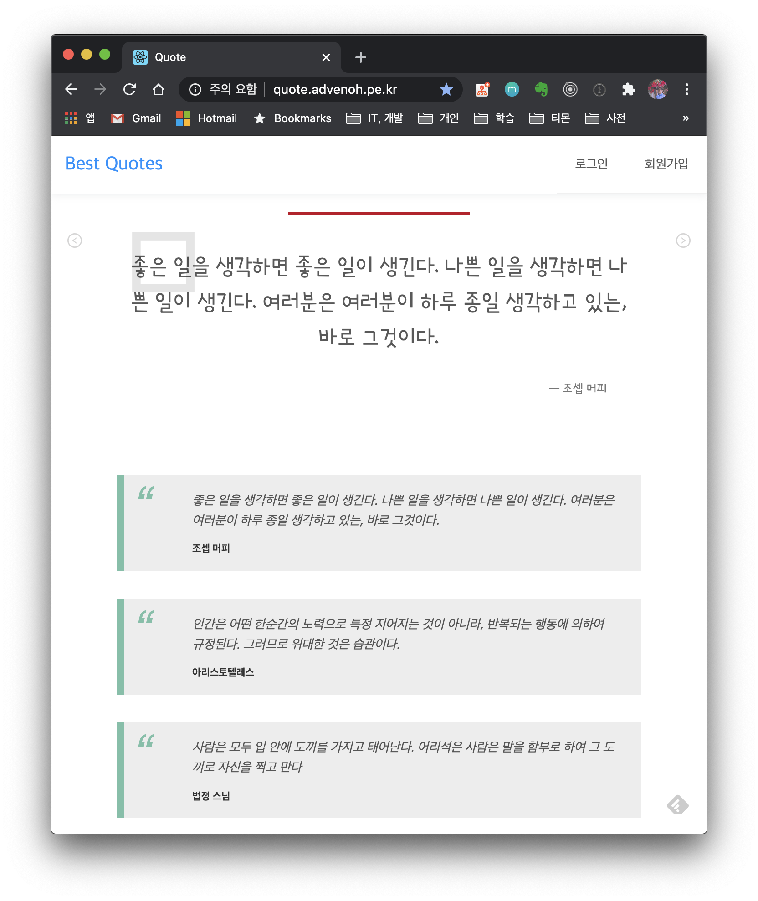
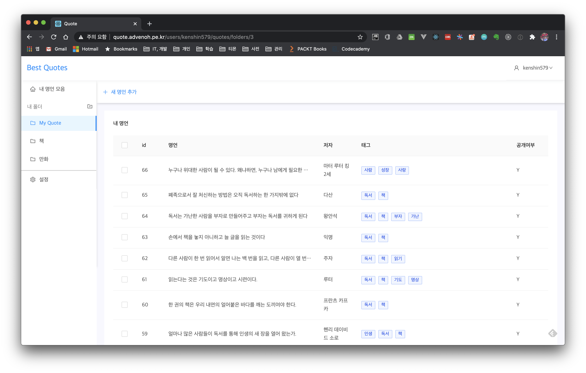
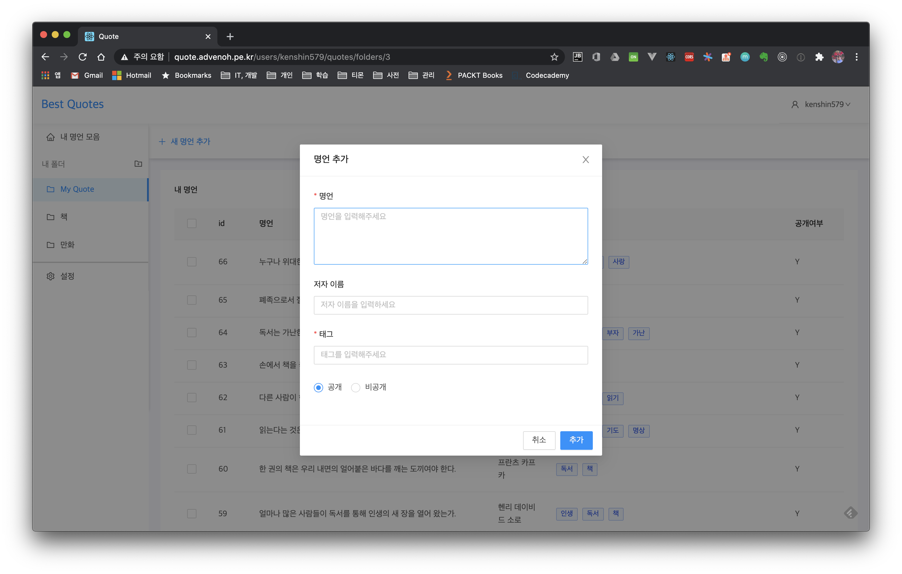

[](https://travis-ci.org/kenshin579/app-quotes)


Quotes 검색 사이트 
=====

# 들어가며

명언을 쉽게 검색할 수 있는 웹 사이트입니다. 개인 명언도 생성하고 관리할 수 있도록 어드민 페이지도 제공합니다. 
현재 베타 버전으로 배포된 사이트에서는 검색 기능은 빠져 있지만, 하루마다 랜덤한 명언 리스트를 보여줍니다.  
추후 더 새로운 기능들을 개발할 예정입니다. 


## 기능

- 로그인 페이지
- 명언 관리 페이지
  - 폴더
  - 명언 생성/수정/삭제
- 매일 명언 목록
- 기타
  - 매일 자동으로 명언 트위터 계정 ([@DailyQuotesKr](https://twitter.com/DailyQuotesKr))으로 업로드

## 화면

### 1. 메인 화면



### 2. 명언 관리 페이지





# 개발환경

- 언어 : Java 1.8 + React
- IDE : Intellij
- Dependency
  - Spring Boot 2.3.1
  - JPA
  - Database
    - MariaDB
  - Lombok
  - Maven

# 빌드 및 실행

빌드 및 실행은 맥 환경 기준으로 설명합니다. 

## 1. BE 서버 실행하기

Database 도커로 실행하기

```bash
$ docker-compose up -d
```

Maven 명령어로 패키지 빌드 이후 스프링부트를 실행합니다. 

```bash
$ mvn clean package
$ mvn spring-boot:run
```

## 2. FE 페이지 실행하기

app 폴더 이동후 package 설치이후에 run start로 실행하면 됩니다. 

```bash
$ cd app
$ npm i
$ npm run start
```

http://localhost:3000로 접속하면 됩니다. 


## Production으로 빌드하기

Production으로 빌드하려면 아래와 같이 -P 옵션에 real 값으로 패키지하면 FE 빌드시 production 모드로 빌드하여 jar 파일에 FE 파일도 같이 포함되어 빌드하게 됩니다. 

```bash
$ mvn clean package -P real
```

http://localhost:8080로 접속해보세요. 

## Contributions

많은 기능은 계획 되어 있습니다. 스터디하면서 더 발전 시킬 예정입니다. 누구나 참여 가능합니다. Issue 페이지를 참고해주세요. 
감사합니다. 

https://github.com/kenshin579/app-quotes/issues